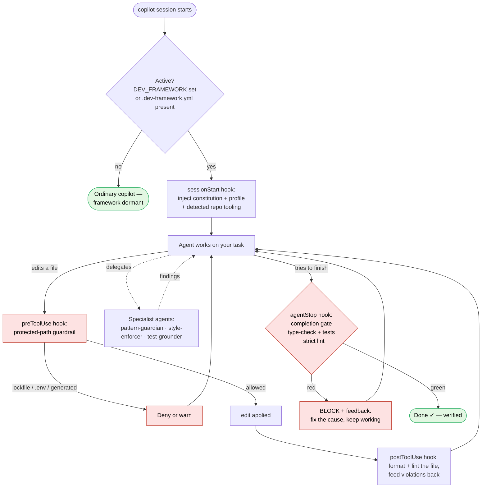

# dev-framework

**Make Copilot CLI prove its work instead of trusting it.** AI coding agents are fast but
undisciplined: they drift from your conventions, reinvent helpers that already exist, skip
tests, and declare "done" on code they never ran. dev-framework is a Copilot CLI plugin
that puts an automatic quality gate around every session — so the agent formats, lints,
matches your existing patterns, gets peer-reviewed, and **cannot finish until your tests
actually pass**.

> Use it when you want to hand a Copilot session a real task and trust the output enough to
> stop babysitting it — on your project, in your style, grounded in your test suite.

**Typical uses**
- Let an agent implement a feature or fix a bug in a large codebase without it drifting or
  re-inventing utilities — and without you re-reviewing slop.
- Enforce one team-wide quality bar across every contributor's Copilot sessions by
  committing a single `.dev-framework.yml`.
- Run long or autonomous sessions safely: a failing test suite blocks completion, and
  protected files (lockfiles, `.env`, generated code) can't be edited.

It's a single self-contained plugin, **dormant until a session opts in**, so installing it
never changes ordinary `copilot` behavior. Dial the intensity from *advisory* (just coach
me) to *strict* (hard gate) per session or per repo.

## Quick start

```bash
# Install (any machine) — from GitHub via the official plugin marketplace flow:
copilot plugin marketplace add anticomputer/dev-framework
copilot plugin install dev-framework@dev-framework
#   …or, from a local clone:  ./install.sh

export PATH="$PWD/bin:$PATH"       # put the `df` CLI on your PATH

cd ~/my/project
df init                            # detect the stack, write a tailored .dev-framework.yml
df status                          # see the resolved profile and detected tooling
df                                 # launch copilot with the framework active
```

The plugin is **dormant by default** — installing it never changes ordinary `copilot`
behavior until a session opts in.

## Intensity profiles — the main dial

One knob sets how hard the framework pushes. Set it per repo (`profile:` in
`.dev-framework.yml`) or per session (`DEV_FRAMEWORK=<profile> copilot`, or `df <profile>`).

| Profile | Edit-time feedback | Completion gate | Protected paths |
|---------|-------------------|-----------------|-----------------|
| `off` | — (fully dormant) | — | — |
| `advisory` | format + lint + review feedback | runs & reports, **never blocks** | warns |
| `standard` | format + lint + review feedback | **blocks** on failing type-check/tests | **denies** edits |
| `strict` | format + lint + review feedback | also blocks on **lint of changed files** | **denies** edits |

An explicit `DEV_FRAMEWORK` value always overrides the repo's `profile:`. Any individual
behavior can still be forced via config keys (e.g. `gate_block_on_failure: false`).

## The `df` CLI

```
df [copilot args...]   launch active (honors the repo profile; defaults to standard)
df strict|standard|advisory|off [args...]   launch in a specific profile
df init [--force] [--profile P]             write a tailored .dev-framework.yml here
df status                                   show resolved profile + detected tooling
df help
```

`df` with no profile honors a repo's `.dev-framework.yml`; with a profile it overrides for
that session. `df off` runs a fully dormant session.

## How it works

The framework hooks into the Copilot session lifecycle. When a session opts in, it injects
your discipline up front, checks every edit as it happens, and gates completion on real
tests:



Intensity profile changes how hard the gates push: **advisory** never blocks (everything
is feedback), **standard** blocks on failing type-check/tests and denies protected edits,
**strict** also blocks on lint of changed files.

### The primitives

Four Copilot CLI extension primitives, verified against the CLI itself:

| Layer | Primitive | Role |
|-------|-----------|------|
| **Constitution** | `rules/*.md` injected at `sessionStart` | Quality bar, match-existing-patterns, testing discipline, delegation loop. Injected into context only when the framework is active (plugins can't contribute always-on instructions, so the `sessionStart` hook delivers them — which keeps them dormant otherwise). |
| **Specialists** | `agents/` | `pattern-guardian` (anti-drift), `style-enforcer`, `test-grounder` — investigation-only reviewers the agent delegates to. |
| **Continuous engine** | `hooks/` | `sessionStart` injects a profile banner + this repo's tooling; `preToolUse` guards protected paths; `postToolUse` formats + lints each edited file and feeds violations back; `agentStop` is the completion gate. |
| **Workflows** | `skills/` | `peer-review`, `ground-in-tests`, `match-patterns` — codified, invokable procedures. |

Hook scripts use the `$PLUGIN_ROOT` and `$COPILOT_PROJECT_DIR` variables the CLI injects,
so the framework works in **any** repository without copying files into it.

### The completion gate, in practice

On `agentStop` the gate (standard/strict) runs type-check + tests and blocks finishing
while they're red, feeding the failure back so the agent fixes the cause. It is designed
not to get in the way:

- **Skips** entirely when the session changed no files (`gate_skip_unchanged`).
- Can **scope** tests to changed files (`gate_scope: changed` + `test_changed: "<cmd {files}>"`).
- Honors a per-command **time budget** (`gate_timeout`, needs the `timeout` tool).
- **Stands down** after `gate_max_blocks` attempts (and says so loudly) so a genuinely
  stuck failure never traps the session.

## Configure per project

`df init` writes `.dev-framework.yml`; `.dev-framework.example.yml` documents every key.
All keys are optional — blank values are auto-detected. **Commit `.dev-framework.yml`** to
give a whole team identical enforcement.

Key options: `profile`, `test`/`typecheck`/`format`/`lint` (+ per-language `format.<ext>` /
`lint.<ext>`), `precommit`, `format_on_edit`/`lint_on_edit`, the `gate_*` set,
`protect`/`protect_mode`/`protect_off`, `exclude` (globs to skip for format/lint), and
`style_guide`.

## Language support

The framework is language-agnostic. For each edited file it picks the right formatter and
linter by extension, and it discovers repo-level test/type-check commands — running **only
tools that are actually installed**. Detection order, highest priority first:

1. **Explicit config** — `test`/`typecheck`, the global `format`/`lint`, or per-language
   `format.<ext>` / `lint.<ext>` overrides.
2. **Your project's task runners** — `make` / `just` targets and npm scripts (`test`,
   `typecheck`), and **pre-commit** (`.pre-commit-config.yaml`) for per-file format+lint.
3. **Built-in detection** by ecosystem / extension:
   - **Tests:** npm/pnpm/yarn, pytest, `go test`, `cargo test`, RSpec/Rake, Gradle/Maven,
     `dotnet test`, `mix test`, PHPUnit, sbt, `swift test`, dart/flutter, deno, make/just.
   - **Type-check:** `tsc`, mypy, pyright, flow.
   - **Format:** prettier (JS/TS/JSON/CSS/HTML/MD/YAML/…), ruff/black, gofmt/gofumpt,
     rustfmt, rubocop, google-java-format, ktlint, php-cs-fixer, csharpier, swiftformat,
     clang-format, shfmt, stylua, scalafmt, dart, terraform, taplo, `mix format`, zig.
   - **Lint:** eslint, ruff/flake8, rubocop, phpcs, shellcheck, luacheck, ktlint, tflint,
     stylelint, yamllint, hadolint.

Run **`df status`** in any repo to see exactly which commands resolve for the file types
present there. Anything missing or wrong? Pin it with `test:`, `format.<ext>:`, etc.

## Protected paths

The `preToolUse` guardrail blocks edits to lockfiles, `.env`, vendored/generated code, and
build output by default (deny in standard/strict, warn in advisory). Override with
`protect:` (space-separated globs) or disable with `protect_off: true`.

## Layout

```
plugin.json                     # manifest (agents/skills/hooks)
.github/plugin/marketplace.json # marketplace entry (so it installs by name)
rules/                          # constitution source, injected at sessionStart when active
agents/                         # pattern-guardian, style-enforcer, test-grounder
hooks/hooks.json + hooks/lib/   # sessionStart, preToolUse, postToolUse, agentStop + lib
skills/                         # peer-review, ground-in-tests, match-patterns
.dev-framework.example.yml      # per-project config template
bin/df                          # the df CLI / launcher
install.sh / uninstall.sh       # convenience wrappers around `copilot plugin`
```

## Install / manage / uninstall

Installation uses the **official Copilot CLI plugin commands** — no manual config editing.

```bash
# From GitHub (any machine):
copilot plugin marketplace add anticomputer/dev-framework
copilot plugin install dev-framework@dev-framework

# From a local clone (registers this dir as a marketplace, then installs):
./install.sh

# Manage:
copilot plugin list
copilot plugin update dev-framework      # after new changes are pushed
copilot plugin uninstall dev-framework   # (or ./uninstall.sh)
```

Plugins are cached on install, so after pushing changes run `copilot plugin update
dev-framework` (or re-install) to pick them up. Inside Copilot, `/plugin list`, `/agent`,
and `/skills list` confirm the framework loaded.

> Note: direct `owner/repo`, URL, and local-path installs are being deprecated in favor of
> the `plugin@marketplace` flow above — which is why both install paths register a
> marketplace first.
