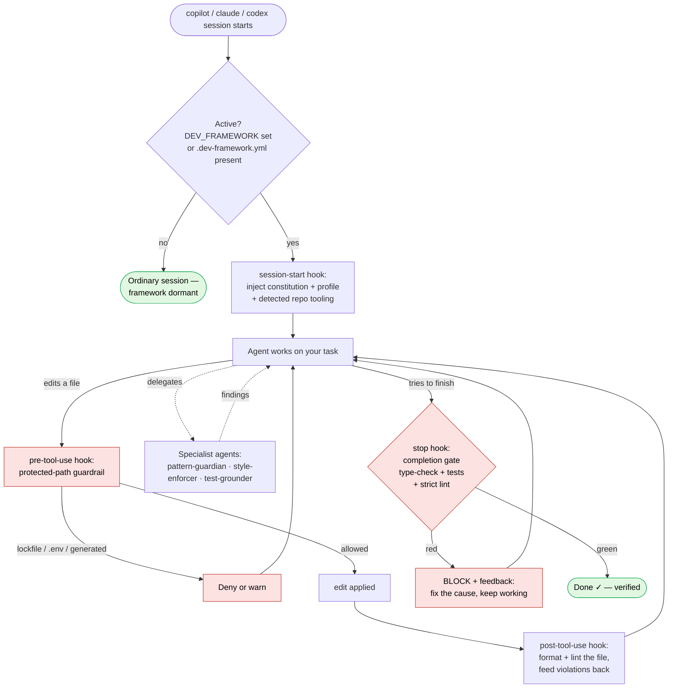

# dev-framework

**Make your coding agent prove its work instead of trusting it.** AI coding agents are fast
but undisciplined: they drift from your conventions, reinvent helpers that already exist,
skip tests, and declare "done" on code they never ran. dev-framework is a plugin for
**GitHub Copilot CLI, Claude Code, and Codex CLI** that puts an automatic quality gate around every
session — so the agent formats, lints, matches your existing patterns, gets peer-reviewed,
and **cannot finish until your tests actually pass**.

> Use it when you want to hand a session a real task and trust the output enough to stop
> babysitting it — on your project, in your style, grounded in your test suite.

One plugin, one `.dev-framework.yml`, three hosts: the same hook scripts, the same
constitution, the same specialists, and the same completion gate — see
[Hosts](#hosts-copilot-cli-claude-code-and-codex-cli).

**Typical uses**
- Let an agent implement a feature or fix a bug in a large codebase without it drifting or
  re-inventing utilities — and without you re-reviewing slop.
- Enforce one team-wide quality bar across every contributor's sessions by committing a
  single `.dev-framework.yml` — even when the team uses Copilot CLI, Claude Code, and
  Codex CLI.
- Run long or autonomous sessions safely: a failing test suite blocks completion, and
  protected files (lockfiles, `.env`, generated code) can't be edited.

It's a single self-contained plugin, **dormant until a session opts in**, so installing it
never changes ordinary `copilot`, `claude`, or `codex` behavior. Dial the intensity from *advisory*
(just coach me) to *strict* (hard gate) per session or per repo.

## Quick start

```bash
# Install (any machine) — via each host's official plugin marketplace flow:
copilot plugin marketplace add anticomputer/dev-framework          # Copilot CLI
copilot plugin install dev-framework@dev-framework

claude plugin marketplace add anticomputer/dev-framework           # Claude Code
claude plugin install dev-framework@dev-framework --scope user

codex plugin marketplace add anticomputer/dev-framework            # Codex CLI
codex plugin add dev-framework@dev-framework
#   …or, from a local clone, into every CLI you have:  ./install.sh

export PATH="$PWD/bin:$PATH"       # put the `df` CLI on your PATH

cd ~/my/project
df init                            # detect the stack, write a tailored .dev-framework.yml
df status                          # see the resolved host, profile, and detected tooling
df                                 # launch your CLI with the framework active
df codex strict                    # …or pick a host and an intensity explicitly
```

The plugin is **dormant by default** — installing it never changes ordinary `copilot`,
`claude`, or `codex` behavior until a session opts in. In Codex, review and trust the
installed hooks with `/hooks` before expecting enforcement to run.

## See it in action

[**examples/todo-service**](examples/todo-service/WALKTHROUGH.md) is a complete worked
example: it shows how a project defines its conventions (a `.dev-framework.yml`, a `STYLE.md`,
and `AGENTS.md`), then walks through a real change where the framework keeps the agent on the
rails — reusing existing patterns, fixing lint as it types, and **blocking a premature
"done" on a failing test** until it's fixed. Start there if you want the 2-minute "why."

## How is this different from `AGENTS.md`?

They work at different layers, and they're complementary: **`AGENTS.md` tells the agent what
to do; dev-framework verifies that it actually did it — and refuses work that doesn't measure
up.** Instruction vs. enforcement; trust vs. verify.

| | `AGENTS.md` / `CLAUDE.md` / custom instructions | dev-framework |
|---|---|---|
| **Mechanism** | Passive prose injected into context | Deterministic hooks that run real tools |
| **Compliance** | Probabilistic — the model *may* follow | Enforced — the gate *blocks* on failure |
| **"Tests pass"** | The model can claim it (and hallucinate success) | `pytest` actually runs; truth is the exit code, not self-report |
| **Over a long session** | Dilutes as context fills ("context rot") | Fires on every edit and at completion, regardless of context |
| **Feedback** | Abstract rules | The *actual* lint/format/test output piped back at the moment it matters |
| **Protected files** | Can ask nicely | Can *deny* the edit (`preToolUse`) |
| **Style review** | One monolithic instruction blob | Specialist subagents, each in its own context window |

The gap `AGENTS.md` can't close: it relies on the model *choosing* to follow instructions and
*honestly reporting* results. Under context pressure an agent will skip the test, reinvent a
helper, or say "done ✓" on red. dev-framework removes that trust assumption — the linter runs,
the suite runs, and a failing gate physically stops completion.

**It doesn't replace `AGENTS.md` — it enforces it.** Keep your prose conventions in
`AGENTS.md` / `STYLE.md`; the framework injects them *and* makes them stick (see the
[walkthrough](examples/todo-service/WALKTHROUGH.md)).

When is `AGENTS.md` alone enough? For a strong model on a small task with no test suite, often
yes. The framework earns its keep on long or autonomous sessions, large codebases, teams, and
anywhere "did it *really* pass?" actually matters.

## Intensity profiles — the main dial

One knob sets how hard the framework pushes. Set it per repo (`profile:` in
`.dev-framework.yml`) or per session (`DEV_FRAMEWORK=<profile> copilot`,
`DEV_FRAMEWORK=<profile> claude`, `DEV_FRAMEWORK=<profile> codex`, or `df <profile>`).
It means the same thing on all three hosts.

| Profile | Edit-time feedback | Completion gate | Protected paths |
|---------|-------------------|-----------------|-----------------|
| `off` | — (fully dormant) | — | — |
| `advisory` | format + lint + review feedback | runs & reports, **never blocks** | warns |
| `standard` | format + lint + review feedback | **blocks** on failing type-check/tests | **denies** edits |
| `strict` | format + lint + review feedback | also blocks on **lint of changed files** | **denies** edits |

An explicit `DEV_FRAMEWORK` value always overrides the repo's `profile:`. Any individual
behavior can still be forced via config keys (e.g. `gate_block_on_failure: false`).

## The `df` CLI

```
df [args...]           launch active (honors the repo profile; defaults to standard)
df strict|standard|advisory|off [args...]   launch in a specific profile
df claude|copilot|codex [args...]           launch a specific host
df init [--force] [--profile P]             write a tailored .dev-framework.yml here
df status                                   show resolved host + profile + detected tooling
df help
```

`df` with no profile honors a repo's `.dev-framework.yml`; with a profile it overrides for
that session. `df off` runs a fully dormant session. A host and a profile combine in either
order (`df claude strict`, `df strict claude`), and everything `df` doesn't recognize is
passed straight through to the CLI.

**Which host does bare `df` launch?** First `$DF_HOST`, then `host:` in
`.dev-framework.yml`, then whichever CLI is installed — preferring Copilot CLI, then
Claude Code, then Codex CLI.
`df` is only a launcher: enforcement is identical whichever CLI ends up running.

## How it works

The framework hooks into the session lifecycle of whichever CLI you run. When a session
opts in, it injects your discipline up front, checks every edit as it happens, and gates
completion on real tests:


```mermaid
flowchart TD
    A([copilot / claude / codex session starts]) --> B{Active?<br/>DEV_FRAMEWORK set<br/>or .dev-framework.yml present}
    B -- no --> Z([Ordinary session —<br/>framework dormant])
    B -- yes --> C[session-start hook:<br/>inject constitution + profile<br/>+ detected repo tooling]
    C --> D[Agent works on your task]

    D -->|edits a file| F[pre-tool-use hook:<br/>protected-path guardrail]
    F -->|lockfile / .env / generated| X[Deny or warn]
    X --> D
    F -->|allowed| G[edit applied]
    G --> H[post-tool-use hook:<br/>format + lint the file,<br/>feed violations back]
    H --> D

    D -.delegates.-> R[Specialist agents:<br/>pattern-guardian · style-enforcer · test-grounder]
    R -.findings.-> D

    D -->|tries to finish| J{stop hook:<br/>completion gate<br/>type-check + tests<br/>+ strict lint}
    J -->|red| K[BLOCK + feedback:<br/>fix the cause, keep working]
    K --> D
    J -->|green| L([Done ✓ — verified])

    classDef gate fill:#fde2e2,stroke:#c0392b,color:#000;
    classDef pass fill:#e2f7e2,stroke:#27ae60,color:#000;
    class F,J,X,K gate;
    class L,Z pass;
```

Intensity profile changes how hard the gates push: **advisory** never blocks (everything
is feedback), **standard** blocks on failing type-check/tests and denies protected edits,
**strict** also blocks on lint of changed files.

### The primitives

Four framework primitives, adapted to each CLI's native extension surface and verified
against each CLI's own docs:

| Layer | Primitive | Role |
|-------|-----------|------|
| **Constitution** | `rules/*.md` injected at session start | Quality bar, match-existing-patterns, testing discipline, delegation loop. Injected into context only when the framework is active, so installation remains dormant otherwise. |
| **Specialists** | `agents/` + `codex-agents/` | `pattern-guardian` (anti-drift), `style-enforcer`, `test-grounder` — native plugin agents on Copilot CLI and Claude Code; optional installer-managed read-only agents on Codex CLI, with built-in subagents as the marketplace-only fallback. |
| **Continuous engine** | `hooks/` | Session start injects a profile banner + this repo's tooling; the pre-tool hook guards protected paths; the post-tool hook formats + lints each edited file and feeds violations back; the stop hook is the completion gate. |
| **Workflows** | `skills/` | `peer-review`, `ground-in-tests`, `match-patterns` — codified, invokable procedures. |

Hook scripts read the plugin-root and project-dir variables the host injects
(`$PLUGIN_ROOT`/`$COPILOT_PROJECT_DIR`, `$CLAUDE_PLUGIN_ROOT`/`$CLAUDE_PROJECT_DIR`, or
Codex's `$PLUGIN_ROOT` with the session working directory), so
the framework works in **any** repository without copying files into it.

### The completion gate, in practice

When the agent tries to finish (`agentStop` on Copilot CLI, `Stop` on Claude Code and Codex CLI) the gate
(standard/strict) runs type-check + tests and blocks finishing while they're red, feeding
the failure back so the agent fixes the cause. It is designed not to get in the way:

- **Skips** entirely when the session changed no files (`gate_skip_unchanged`).
- Can **scope** tests to changed files (`gate_scope: changed` + `test_changed: "<cmd {files}>"`).
- Honors a per-command **time budget** (`gate_timeout`, needs the `timeout` tool).
- **Stands down** after `gate_max_blocks` attempts (and says so loudly) so a genuinely
  stuck failure never traps the session.

## Configure per project

`df init` writes `.dev-framework.yml`; **[`CONFIGURATION.md`](CONFIGURATION.md) is the full
reference** — the grammar, every key with its type/default, substitution tokens, glob
syntax, and worked examples. `.dev-framework.example.yml` is an annotated template. All keys
are optional — blank values are auto-detected. **Commit `.dev-framework.yml`** to give a
whole team identical enforcement on any host.

Key options at a glance: `profile`, `test`/`typecheck`/`format`/`lint` (+ per-language
`format.<ext>` / `lint.<ext>`), `precommit`, `format_on_edit`/`lint_on_edit`, the `gate_*`
set, `protect`/`protect_mode`/`protect_off`, `exclude`, `style_guide`, and `host`. See
[CONFIGURATION.md](CONFIGURATION.md) for details.

## Language support

The framework is language-agnostic. For each edited file it picks the right formatter and
linter by extension, and it discovers repo-level test/type-check commands — running **only
tools that are actually installed**. Detection order, highest priority first:

1. **Explicit config** — `test`/`typecheck`, the global `format`/`lint`, or per-language
   `format.<ext>` / `lint.<ext>` overrides.
2. **Your project's task runners** — `make` / `just` targets and npm scripts (`test`,
   `typecheck`), and **pre-commit** (`.pre-commit-config.yaml`) for per-file format+lint.
3. **Built-in detection** by ecosystem / extension:
   - **Tests:** npm/pnpm/yarn, pytest, `go test`, `cargo test`, RSpec/Rake, Gradle/Maven,
     `dotnet test`, `mix test`, PHPUnit, sbt, `swift test`, dart/flutter, deno, make/just.
   - **Type-check:** `tsc`, mypy, pyright, flow.
   - **Format:** prettier (JS/TS/JSON/CSS/HTML/MD/YAML/…), ruff/black, gofmt/gofumpt,
     rustfmt, rubocop, google-java-format, ktlint, php-cs-fixer, csharpier, swiftformat,
     clang-format, shfmt, stylua, scalafmt, dart, terraform, taplo, `mix format`, zig.
   - **Lint:** eslint, ruff/flake8, rubocop, phpcs, shellcheck, luacheck, ktlint, tflint,
     stylelint, yamllint, hadolint.

Run **`df status`** in any repo to see exactly which commands resolve for the file types
present there. Anything missing or wrong? Pin it with `test:`, `format.<ext>:`, etc.

## Protected paths

The pre-tool-use guardrail blocks edits to lockfiles, `.env`, vendored/generated code, and
build output by default (deny in standard/strict, warn in advisory) — it covers Copilot's
`edit`/`create`, Claude Code's `Write`/`Edit`/`MultiEdit`/`NotebookEdit`, and every file in
a Codex `apply_patch` call. Override
with `protect:` (space-separated globs) or disable with `protect_off: true`.

## Layout

One tree, three host packages. Everything that does the actual work — the constitution, the
specialists, the skills, and every hook script — is shared; only the per-host manifests
and hook-event wiring differ.

```
plugin.json                     # Copilot CLI manifest      (agents/skills/hooks)
.github/plugin/marketplace.json # Copilot CLI marketplace entry
.claude-plugin/plugin.json      # Claude Code manifest
.claude-plugin/marketplace.json # Claude Code marketplace entry
.codex-plugin/plugin.json       # Codex CLI manifest
.agents/plugins/marketplace.json # Codex CLI marketplace entry
hooks/hooks.copilot.json        # Copilot CLI event wiring   (sessionStart, preToolUse, …)
hooks/hooks.claude.json         # Claude Code event wiring   (SessionStart, PreToolUse, …)
hooks/hooks.codex.json          # Codex CLI event wiring      (SessionStart, PreToolUse, …)
hooks/lib/                      # ← the shared engine all wirings call
rules/                          # constitution source, injected at session start when active
agents/                         # pattern-guardian, style-enforcer, test-grounder
codex-agents/                   # installer-managed read-only Codex specialist definitions
skills/                         # peer-review, ground-in-tests, match-patterns
.dev-framework.example.yml      # per-project config template
bin/df                          # the df CLI / launcher (also on PATH inside Claude Code)
install.sh / uninstall.sh       # native plugin management for all three CLIs
CONFIGURATION.md                # full .dev-framework.yml reference
examples/todo-service/          # worked example + WALKTHROUGH.md
```

## Install / manage / uninstall

Installation uses each host's **official plugin commands** — no manual config editing.

```bash
# From GitHub (any machine) — Copilot CLI:
copilot plugin marketplace add anticomputer/dev-framework
copilot plugin install dev-framework@dev-framework

# From GitHub (any machine) — Claude Code:
claude plugin marketplace add anticomputer/dev-framework
claude plugin install dev-framework@dev-framework --scope user

# From GitHub (any machine) — Codex CLI:
codex plugin marketplace add anticomputer/dev-framework
codex plugin add dev-framework@dev-framework

# From a local clone — installs into every CLI found on PATH
# (or `./install.sh claude` / `./install.sh copilot` / `./install.sh codex` for one):
./install.sh

# Manage:
copilot plugin list                       claude plugin list
codex plugin list                         codex plugin marketplace list
copilot plugin update dev-framework       claude plugin update dev-framework
codex plugin marketplace upgrade dev-framework && codex plugin add dev-framework@dev-framework
copilot plugin uninstall dev-framework    claude plugin uninstall dev-framework
codex plugin remove dev-framework
#   …or ./uninstall.sh [claude|copilot|codex]
```

All hosts cache plugins on install, so update or reinstall after changing the plugin. To
confirm it loaded: `/plugin list`, `/agent`, and `/skills list` in Copilot CLI; `/plugin`
and `/agents` in Claude Code; `/plugins` and `/hooks` in Codex CLI. Codex requires hook
review after installation or hook changes. The native Codex marketplace contains hooks and
skills; `./install.sh codex` additionally installs the named read-only specialist agents.

> Note: on Copilot CLI, direct `owner/repo`, URL, and local-path installs are being
> deprecated in favor of the `plugin@marketplace` flow above — which is why every install
> path registers a marketplace first.

## Hosts: Copilot CLI, Claude Code, and Codex CLI

All three hosts are first-class. The framework is one shared engine (`hooks/lib/*.sh`) behind
three manifests, so a repo's `.dev-framework.yml` produces the same enforcement on each. What
differs is only the plumbing each CLI expects:

| | GitHub Copilot CLI | Claude Code | Codex CLI |
|---|---|---|---|
| **Manifest** | `plugin.json` | `.claude-plugin/plugin.json` | `.codex-plugin/plugin.json` |
| **Marketplace** | `.github/plugin/marketplace.json` | `.claude-plugin/marketplace.json` | `.agents/plugins/marketplace.json` |
| **Hook wiring** | `hooks/hooks.copilot.json` | `hooks/hooks.claude.json` | `hooks/hooks.codex.json` |
| **Constitution** | `sessionStart` | `SessionStart` (`startup`/`resume`/`clear`/`compact`/`fork`) | `SessionStart` (`startup`/`resume`/`clear`/`compact`) |
| **Protected paths** | `preToolUse` on `edit`/`create` | `PreToolUse` on `Write`/`Edit`/`MultiEdit`/`NotebookEdit` | `PreToolUse` on multi-file `apply_patch` |
| **Format + lint on edit** | `postToolUse` | `PostToolUse` | `PostToolUse` |
| **Completion gate** | `agentStop` | `Stop` | `Stop` |
| **Blocking verdict** | top-level `permissionDecision` / `decision` | `hookSpecificOutput` keyed by `hookEventName` | Codex hook-specific permission output and top-level stop decision |
| **Paths injected** | `$PLUGIN_ROOT`, `$COPILOT_PROJECT_DIR` | `$CLAUDE_PLUGIN_ROOT`, `$CLAUDE_PROJECT_DIR`, `$CLAUDE_PLUGIN_DATA` | `$PLUGIN_ROOT`, `$PLUGIN_DATA`, session working directory |
| **Specialist names** | `pattern-guardian` | `dev-framework:pattern-guardian` | `dev_framework_pattern_guardian` when installed; built-in fallback otherwise |
| **Skill names** | `peer-review` | `/dev-framework:peer-review` | `$dev-framework:peer-review` |
| **Launch active** | `DEV_FRAMEWORK=strict copilot` · `df copilot strict` | `DEV_FRAMEWORK=strict claude` · `df claude strict` | `DEV_FRAMEWORK=strict codex` · `df codex strict` |

The session-start banner tells the agent which host it's on and names the specialists and
skills the way *that* host expects them to be invoked, so the delegation loop works without
the agent guessing. Under Claude Code the specialists are additionally locked down with
`disallowedTools`, so "investigation only" is enforced by the host rather than only asked
for in the prompt. `bin/` is on the Bash tool's `PATH` inside a Claude Code session, so
`df status` works from within a session.

Codex marketplace-only installs use built-in `explorer` or `default` subagents with the
bundled skills. The repository installer adds `dev_framework_pattern_guardian`,
`dev_framework_style_enforcer`, and `dev_framework_test_grounder` under the user's Codex
home with `sandbox_mode = "read-only"`; uninstall preserves any definition the user changed.

Activation is identical on all three: a `.dev-framework.yml` in the repo, or `DEV_FRAMEWORK` in
the environment. Nothing else needs to change to move a repo between hosts.

Codex support in this project means Codex CLI. Codex desktop, ChatGPT, and the Codex IDE
extension are outside the supported surface.
